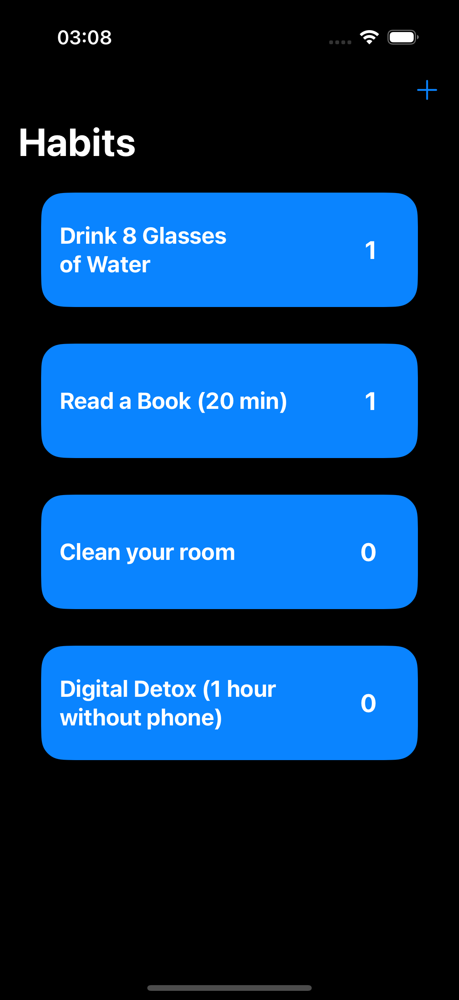

# Habit-Tracker

## Screenshots  

  
  

## Overview  
Habit-Tracker is a simple yet effective habit tracker app built with **SwiftUI**. The app allows users to track their habits, maintain streaks, and visualize progress in an intuitive way.  

### How to Build/Run  
1. Clone this repository.  
2. Open the project in **Xcode 15 or later**.  
3. Build and run the app on the simulator or a physical iOS device running iOS 17+.

---

## Architecture  
The project follows the **MVP (Model-View-Presenter)** architectural pattern.  
- **Model**: Defines the data structure of habits, including streaks and completion tracking.  
- **View**: SwiftUI views that display the data and forward user actions to the presenter.  
- **Presenter**: Handles business logic, updates streaks, and communicates between the Model and the View.  

This architecture was chosen because it provides a clear separation of concerns, improves maintainability, and allows for easier testing of business logic independent of the UI.  

---

## Use of AI Tools  

### Which tools did you use?  
- **ChatGPT (OpenAI)** for guidance, boilerplate generation, and debugging.  
- **GitHub Copilot** for inline code suggestions inside Xcode.

### What specific parts of the code did you generate with AI?  
- **Onboarding texts:** I used AI to draft the onboarding descriptions and sample habit examples in English.
- **SwiftData help:** I leveraged AI to generate the initial SwiftData boilerplate and CRUD operations for the Habit model.
- **Streak logic:** AI provided a starting point for streak management, but I later refined the logic manually to handle edge cases in date calculations.
- **App icon generation:** I used AI image generation tools to create the initial app icon concepts.

### What parts did you write manually? Why?  
- **UI components:** I created the SwiftUI components myself because they form the foundation of the app’s user experience, and I wanted precise control over the layout and styling.
- **File structure:** I manually organized the project’s file structure since it defines the core architecture of the app and ensures long-term maintainability.
- **Manual testing:** I carried out manual testing on the simulator to validate streak logic, UI behavior, and persistence. This was essential because reliable testing is a cornerstone of the app’s stability.

### What were the limitations of the AI?  
- AI sometimes generated non-optimal or outdated Swift code (e.g., suggesting `@StateObject` where `@ObservedObject` was more appropriate).  
- It occasionally produced duplicate or overly verbose functions, requiring manual refactoring.  
- AI struggled with **complex date calculations** and **streak edge cases**, so I implemented custom logic.

---

## Challenges & Trade-offs  
I didn’t encounter significant challenges. I mainly focused on building the core functionality and kept the design and persistence simple for faster delivery.

---

## Future Improvements  
If I had more time, I would add:  
- Customizable habit colors and icons.  
- Local notifications to remind users of daily habits.  
- Widgets for quick home screen access.  
- iCloud sync for multi-device habit tracking.  
- More analytics (weekly/monthly summaries, longest streaks, etc.).  

---

*HabitTracker is a minimal but solid foundation for a full-featured habit tracking app.*  

